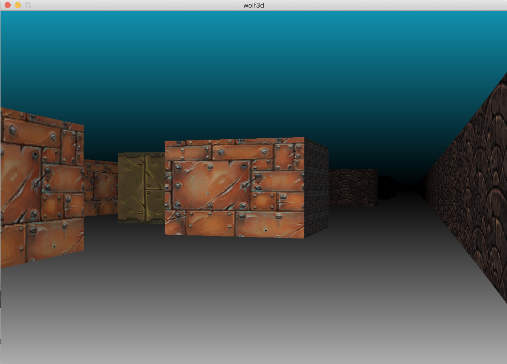

Wolf3d est un projet de l'école 42 à faire en groupe de 2 où il faut faire la représentation en 3D par raycasting d’un labyrinthe dans lequel le joueur peut se déplacer. Dans la partie bonus nous avons fait le mutlithreading et les collisions avec slide.

Contraintes :

- Langage : C
- fonctions autorisés : open, read, write, close, malloc, free, perror, strerror, exit, toutes les fonctions de la lib math (-lm et man 3 math), toutes les fonctions de la MinilibX ou leurs équivalents dans une autre bibliothèque d’affichage.

